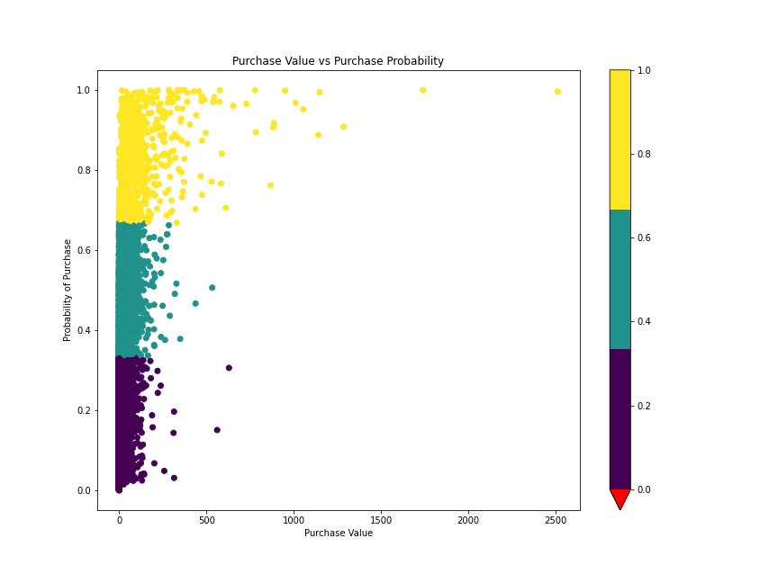

## What is Customer Value?

Customer value or Customer Lifetime Value (CLV) is the total monetary value of transactions/purchases made by a customer with your business over his entire lifetime.

## Objective

The objective was to predict 3 months of sales using the one year history of sales.

Analyze customer purchase behavior to predict their purchases over the next 90-days. 

Create (RFM) features for 2 predictive models (90-day spend amount and spend probability).

## Dataset

Dataset CDNOW

## RFM Features

We aggregates the transaction-level data into the customer level and calculates the recency, frequency, and monetary_value for each customer.

frequency — the number of repeat purchases (more than 1 purchases)

recency — the time between the first and the last transaction

monetary_value — it is the mean of a given customers sales value

## Model1:
Classification Task where we predict, the probability whether a customer will buy or not. 

## Model2: 
Regression Task where we predict, the amount customer will spend in the next 90 days.
We will use FFNN for both the tasks.

## Results:

